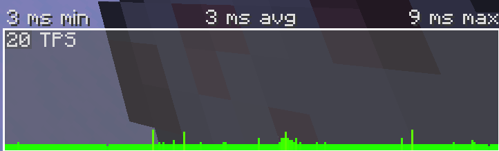
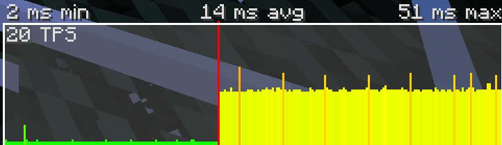
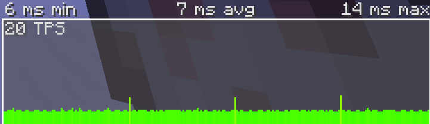

[← Back to the README](../README.md)

# Work in progress
### This file can contain errors or be incomplete.

### Table of contents
- [References and sources](#references-and-sources)
- [Introduction](#introduction)
- [Load Balancing](#load-balancing)


# Introduction

This document is a collection of more advanced methods and techniques that can be used to improve the performance of your datapacks. It is not meant to be a complete guide, but rather a collection of tips and tricks that can be used to improve your datapacks.

Unlike the [basics of optimization document](./basics.md), this document is not meant to be read from top to bottom. Each section is independent from the others, and you can read them in any order you want. That's why there is no indices to each section.

The goal is to gather more advanced methods, giving links and references to external sources. The methods can be mcfunction specific, or more general optimization methods of programming.

# Load Balancing
Load balancing is an extremely important optimization to avoid lag, usually applied to large operations.

First, let's emphasize one thing: In minecraft, the game is updated 20 times per second. Each update is called a tick. In order for the game to maintain this update rate, each tick must be executed in a maximum of 50 milliseconds.

Each command we add to our datapack takes a certain amount of time to execute, and we need to make sure that no tick exceeds this 50 millisecond margin. _Of course, how much each computer can process in a tick depends on the computer, but the idea is the same._

To demonstrate the problem, I made a datapack that burns all entities exposed to the sky. Every tick, it checks for each entity in the game if it is being exposed to the sky, and if it is, it changes the `Fire` NBT to ignite the entity. In our example, the function of checking if the entity is exposed to the sky is extremely heavy.

### The problem

Let's take a look at the duration per TPS graph (which you can open by pressing Alt+F3) in a local world



Seems great! Now let's turn on our datapack. Let's check the graph again



The green graph is before we turn on the datapack, and the yellow after. That's a bad sign. On some computers or servers, this line can go into the red and cause the server to run in slow motion. This can also go into the red according to datapack growth...

We need to make the graph as close as possible to the disabled datapack.

### Finding the problem

We need to understand if it is possible to optimize this. In this example case, we already know that the function of detecting if the entity is exposed to the sky is the problem, and it cannot be optimized directly as there are no further optimizations to be done.

However, there is still a way out. When you no longer have direct optimizations, always ask yourself: does this function really need to be run every tick?

In our case, it doesn't have to be so instantaneous. If you have a few ticks of delay, it will be fine

**Well... let's start with the optimizations.**

### Trying to solve the problem

Let's start by doing what most people do to try to solve this: Use `/schedule `. Instead of checking every tick, I will set it to check every 5 ticks.

Let's start by changing our command from the tick function to a specific function, and trigger the schedule  from the load function

```mcfunction
#> schedule _5t.mcfunction
execute as @e[type=!player] run function example:try_sky_burn

schedule function example:schedule _5t 5t replace
```

```mcfunction
#> on_load.mcfunction
function example:schedule _5t
```

This is already enough to run the function every 5 ticks

Let's reload take a look at the graphic again


Would you say this is acceptable? Wrong! Maybe it's even better, but look at the spikes! The difference from before and now is that before all ticks were slow, now only some. This can still cause lag!

We need to tone down those spikes, but... how?

### The real solution for this problem

We need to distribute the weight of each spike among all ticks, to make the graph flat and reduce the ms max.

Instead of checking all entities in just one tick every 5 ticks, we will check 1/5 of all entities every tick, thus uniformly checking a specified amount of entity every tick.

To implement this system, I will separate the entities into 5 groups. To do this, I will create a score that will cycle between 0 and 4 and will progress with each entity added to the group, and I will give a tag corresponding to the entity's group. _I'm using a score instead of a tag because besides tag verification being faster, minecraft has a bug with scores on despawning entities that can even corrupt your world over time_

First, let's add the score to cycle the groups

```mcfunction
#> on_load.mcfunction
scoreboard objectives add sky_burn_entity_group dummy
scoreboard players set .current_group sky_burn_entity_group 0
scoreboard players set .current_group_to_assign sky_burn_entity_group 0
scoreboard players set .group_count sky_burn_entity_group 5
```

Next, let's create a function to assign a group tag to an entity

```mcfunction
#> assign_group.mcfunction
# Cycling the group
scoreboard players add .current_group_to_assign sky_burn_entity_group 1
scoreboard players operation .current_group_to_assign sky_burn_entity_group %= .group_count sky_burn_entity_group

# Setting the tag group
execute if score .current_group_to_assign sky_burn_entity_group matches 0 run tag @s add sky_burn_group_0
execute if score .current_group_to_assign sky_burn_entity_group matches 1 run tag @s add sky_burn_group_1
execute if score .current_group_to_assign sky_burn_entity_group matches 2 run tag @s add sky_burn_group_2
execute if score .current_group_to_assign sky_burn_entity_group matches 3 run tag @s add sky_burn_group_3
execute if score .current_group_to_assign sky_burn_entity_group matches 4 run tag @s add sky_burn_group_4

# Setting a tag indicating that this entity has been grouped
tag @s add sky_burn_has_group
```

Now, let's put in the tick function to assign a group to entities that do not yet have a group

```mcfunction
#> on_tick.mcfunction
execute as @e[tag=!sky_burn_has_group] run function example:assign_group
```

This is already enough to give each entity a group. Note that I also removed the schedule  functions from the load, since we won't be using it anymore. I also deleted the `schedule _5t.mcfunction` function

Now, we need to modify our tick to select one of the groups to update, and update the corresponding group. Let's do it.

```mcfunction
#> on_tick.mcfunction
# Assign a group to the entities
execute as @e[tag=!sky_burn_has_group] run function example:assign_group

# Cycle the current group being updated
scoreboard players add .current_group sky_burn_entity_group 1
scoreboard players operation .current_group sky_burn_entity_group %= .group_count sky_burn_entity_group

# Execute the verification on the entity of that group
execute if score .current_group sky_burn_entity_group matches 0 as @e[tag=sky_burn_group_0] run function example:try_sky_burn
execute if score .current_group sky_burn_entity_group matches 1 as @e[tag=sky_burn_group_1] run function example:try_sky_burn
execute if score .current_group sky_burn_entity_group matches 2 as @e[tag=sky_burn_group_2] run function example:try_sky_burn
execute if score .current_group sky_burn_entity_group matches 3 as @e[tag=sky_burn_group_3] run function example:try_sky_burn
execute if score .current_group sky_burn_entity_group matches 4 as @e[tag=sky_burn_group_4] run function example:try_sky_burn
```

Now, let's reload and check the graph... and if everything is still working, of course



Much better, and everything still works! Each individual entity is checked every 5 ticks, but not all at the same time.

Note that the spikes in this graph are from the game itself, not the fault of our code.

We have successfully load balanced by distributing the load between the ticks! Yay 🥳🥳

_The more attentive and experienced readers will realize that checking if an entity is exposed to the sky is something trivial using `positioned over`. I added the line `execute as @e as @e as @e` at the end of the function just to make it heavy and be able to better demonstrate things ;)_

### When not to use Load Balancing

You probably noticed that although we have applied load balancing correctly, our datapack has a much higher overhead since it needs to manage and execute commands based on groups. In this case, it was a good thing, as it made the datapack more efficient. But it may not always be so

If you have applied load balancing correctly and the max ms of the graph is still greater than without it, then the overhead is significantly heavier than the operation and you should not apply this. In other words, do not use it if it does not bring a performance benefit.

### Conclusion

We should use load balancing to distribute the weight of our commands by spreading them across ticks.

Knowing this, keep in mind that this is not the only possible use of load balancing. You might want to spread your commands in another way, for example by modifying large areas of blocks separating them into small parts over several ticks. You might also want to have 2 schedules that execute every 2 ticks intercalated with each doing a completely different or intertwined function. The important thing is to distribute the weight of your commands between the tick to keep the graph apartment and avoid tick overload!

# References and sources


[← Back to the README](../README.md)
